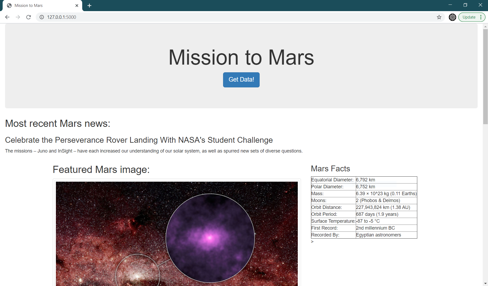
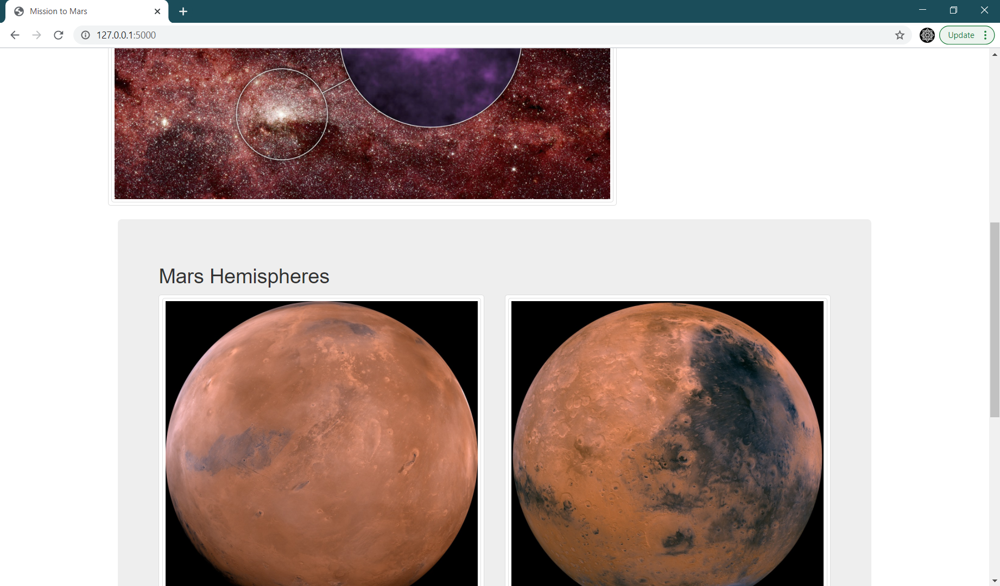

# Web Scraping Homework - Mission to Mars

This assignment is a web application that scrapes various websites for data related to the Mission to Mars and displays the information in a single HTML page. 

## Part 1 - Scraping

The scraping used libraries BeautifulSoup, Pandas, Requests, and Splinter. 

The Jupyter Notebook file called `mission_to_mars.ipynb` is where scraping was originally done for ease of use; after confirming it worked, effectively the same script was moved to `scrape_mars.py` (which later had slight alterations made). The scraping done consists of the following: 
* [Nasa Mars News](https://mars.nasa.gov/news/) - the latest (i.e. first) news title and description

* The full-size version of the current [JPL Featured Space Image](https://www.jpl.nasa.gov/spaceimages/?search=&category=Mars)

* [Mars Facts](https://space-facts.com/mars/) - the table on the right side containing various pieces of basic information about Mars

* Full-size images of all four Martian hemispheres on [this page](https://astrogeology.usgs.gov/search/results?q=hemisphere+enhanced&k1=target&v1=Mar) of USGS Astrogeology.

In `scrape_mars.py`, the scraper() function returns a dictionary of the four pieces of information found above.

- - -

## Part 2 - MongoDB and Flask Application

The Flask app `app.py` puts the dictionary from the scraper function detailed above into MongoDB, and displays them in the appropriate places on the `index.html` page. The scraper function is called upon visiting the route `/scrape`, accessible either manually or through the "Get Data!" button on the main page. 

- - -

## The End Result

Below are some screenshots of what the final application looks like. 

This homework was completed as part of the USC Viterbi Data Analytics Boot Camp. 